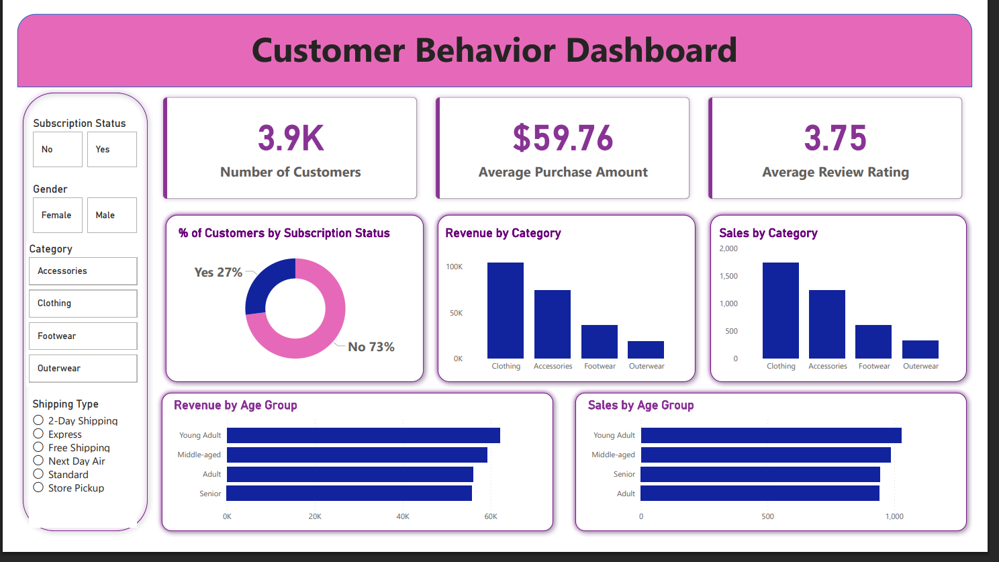

# Customer Shopping Behavior Analysis

## Project Overview
This project analyzes customer shopping behavior using Python, SQL, PostgreSQL, and Power BI.  
The objective is to discover customer purchasing patterns, product preferences, subscription behavior, and revenue insights to support data-driven business decisions.

---

## Technologies Used

- Python
- Pandas
- PostgreSQL
- SQL
- Power BI
- Jupyter Notebook

---

## Dataset Information

- Total Records: 3,900
- Total Columns: 18

### Key Features
- Customer Demographics
- Purchase History
- Product Categories
- Subscription Status
- Discounts & Promo Codes
- Shipping Details
- Review Ratings

---

## Data Cleaning & Preprocessing

Performed using Python and Pandas:

- Missing value handling
- Column standardization
- Feature engineering
- Age group creation
- Purchase frequency analysis
- Data consistency checks
- PostgreSQL database integration

---

## SQL Business Analysis

Performed multiple business-driven SQL analyses including:

- Revenue by Gender
- Top Rated Products
- High Spending Discount Users
- Shipping Type Comparison
- Subscription Analysis
- Customer Segmentation
- Revenue by Age Group
- Top Products per Category

---

## Power BI Dashboard

Interactive dashboard created to visualize:

- Revenue Insights
- Customer Segmentation
- Category-wise Sales
- Subscription Analysis
- Age Group Revenue
- Customer Purchase Trends

---

## Dashboard Preview

---

## Business Recommendations

- Improve subscription benefits
- Introduce loyalty programs
- Optimize discount strategies
- Focus on high-performing products
- Use targeted marketing campaigns

---

## Project Files

| File Name | Description |
|---|---|
| `customer_behavior_analysis.ipynb` | Python analysis notebook |
| `customer_behavior_queries.sql` | SQL business queries |
| `customer_shopping_behavior.csv` | Dataset |
| `dashboard-preview.pdf` | Dashboard report |
| `project-presentation.pptx` | Project presentation |

---

## Key Skills Demonstrated

- Data Cleaning
- Exploratory Data Analysis
- SQL Query Writing
- Business Analytics
- Dashboard Development
- Data Visualization
- Business Recommendations

---

## Author

### Pratyaksha Kumar

LinkedIn:  
www.linkedin.com/in/pratyaksha-kumar

GitHub:  
https://github.com/pratyaksha123-kumar

---

## Future Improvements

- Machine Learning-based customer prediction
- Customer churn analysis
- Real-time dashboard integration
- Advanced customer segmentation

---

## ⭐ If you like this project, give it a star on GitHub!
